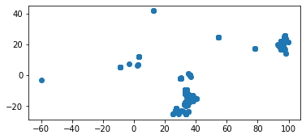
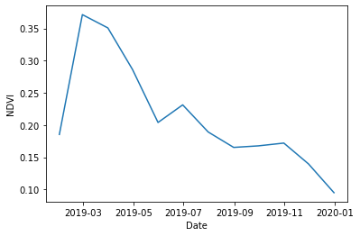

```python
import pandas as pd
import geopandas as gpd
from shapely.geometry import shape
import json

import matplotlib.pyplot as plt
%matplotlib inline
```

Load the CSV file


```python
ndvi = gpd.read_file('landsat8_ndvi_2018-2020_sample-2k.csv')
```

The location is exported from Google Earth Engine in GeoJSON format. We need to convert it to the format accepted for the GeoPandas geometry column.


```python
ndvi['geometry'] = ndvi.apply(lambda row: shape(json.loads(row['.geo'])), axis=1)
```

The dates are strings when they are read in, so we convert them to Pandas DateTime objects.


```python
ndvi['date'] = pd.to_datetime(ndvi['date'])
```

The geometry column allows us to plot the points spatially.


```python
ndvi.plot()
```


    <matplotlib.axes._subplots.AxesSubplot at 0x7fd7ba973f98>





We can also preview the data as with normal pandas dataframes.


```python
ndvi.head()
```


<div>
<style scoped>
    .dataframe tbody tr th:only-of-type {
        vertical-align: middle;
    }

    .dataframe tbody tr th {
        vertical-align: top;
    }

    .dataframe thead th {
        text-align: right;
    }
</style>
<table border="1" class="dataframe">
  <thead>
    <tr style="text-align: right;">
      <th></th>
      <th>system:index</th>
      <th>01-2018 to 02-2018</th>
      <th>01-2019 to 02-2019</th>
      <th>01-2020 to 02-2020</th>
      <th>02-2018 to 03-2018</th>
      <th>02-2019 to 03-2019</th>
      <th>02-2020 to 03-2020</th>
      <th>03-2018 to 04-2018</th>
      <th>03-2019 to 04-2019</th>
      <th>03-2020 to 04-2020</th>
      <th>...</th>
      <th>10-2020 to 11-2020</th>
      <th>11-2018 to 12-2018</th>
      <th>11-2019 to 12-2019</th>
      <th>11-2020 to 12-2020</th>
      <th>12-2018 to 01-2019</th>
      <th>12-2019 to 01-2020</th>
      <th>12-2020 to 01-2021</th>
      <th>date</th>
      <th>.geo</th>
      <th>geometry</th>
    </tr>
  </thead>
  <tbody>
    <tr>
      <th>0</th>
      <td>0</td>
      <td>0.4125303030014038</td>
      <td>0.28317514061927795</td>
      <td></td>
      <td>0.4605826437473297</td>
      <td>0.2888960540294647</td>
      <td></td>
      <td>0.04861186072230339</td>
      <td>0.4281831681728363</td>
      <td>0.29043781757354736</td>
      <td>...</td>
      <td>0.12893478572368622</td>
      <td>0.15392448008060455</td>
      <td>0.2333373874425888</td>
      <td>0.0888809934258461</td>
      <td>0.13741245865821838</td>
      <td>0.21476705372333527</td>
      <td>0.18726448714733124</td>
      <td>2020-02-03</td>
      <td>{"type":"Point","coordinates":[35.32,-15.39]}</td>
      <td>POINT (35.32000 -15.39000)</td>
    </tr>
    <tr>
      <th>1</th>
      <td>1</td>
      <td>0.1489490121603012</td>
      <td>0.14988276362419128</td>
      <td>0.07585914433002472</td>
      <td>0.1529611498117447</td>
      <td>0.1530293971300125</td>
      <td>0.13753148913383484</td>
      <td>0.14787781238555908</td>
      <td>0.14382785558700562</td>
      <td>0.1411036103963852</td>
      <td>...</td>
      <td>0.1493956297636032</td>
      <td>0.17961393296718597</td>
      <td>0.18961374461650848</td>
      <td>0.14799261093139648</td>
      <td>0.14081870019435883</td>
      <td>0.1573752611875534</td>
      <td>0.14265429973602295</td>
      <td>2020-02-03</td>
      <td>{"type":"Point","coordinates":[95.13,22.12]}</td>
      <td>POINT (95.13000 22.12000)</td>
    </tr>
    <tr>
      <th>2</th>
      <td>2</td>
      <td>0.0806429535150528</td>
      <td>0.24006950855255127</td>
      <td></td>
      <td>0.27887722849845886</td>
      <td>0.21174614131450653</td>
      <td>0.07262792438268661</td>
      <td>0.19706475734710693</td>
      <td>0.3393693268299103</td>
      <td>0.3207225203514099</td>
      <td>...</td>
      <td>0.10629143565893173</td>
      <td>0.15993763506412506</td>
      <td>0.11631131172180176</td>
      <td>0.12974923849105835</td>
      <td>0.09734513610601425</td>
      <td>0.08893191069364548</td>
      <td>0.13890498876571655</td>
      <td>2020-02-03</td>
      <td>{"type":"Point","coordinates":[35.27,-13.06]}</td>
      <td>POINT (35.27000 -13.06000)</td>
    </tr>
    <tr>
      <th>3</th>
      <td>3</td>
      <td>0.10528296232223511</td>
      <td>0.11243504285812378</td>
      <td>0.10332165658473969</td>
      <td>0.09719745069742203</td>
      <td>0.10230612009763718</td>
      <td>0.10391374677419662</td>
      <td>0.1181308925151825</td>
      <td>0.12203951179981232</td>
      <td>0.11014188826084137</td>
      <td>...</td>
      <td>0.17543266713619232</td>
      <td>0.14706951379776</td>
      <td>0.15695501863956451</td>
      <td>0.13548612594604492</td>
      <td>0.1449538916349411</td>
      <td>0.12134287506341934</td>
      <td>0.1356714963912964</td>
      <td>2020-02-03</td>
      <td>{"type":"Point","coordinates":[95.25,18.82]}</td>
      <td>POINT (95.25000 18.82000)</td>
    </tr>
    <tr>
      <th>4</th>
      <td>4</td>
      <td>0.1757315993309021</td>
      <td>0.28190967440605164</td>
      <td>0.20617562532424927</td>
      <td>0.22363631427288055</td>
      <td>0.2966252565383911</td>
      <td>0.272464394569397</td>
      <td>0.16276976466178894</td>
      <td>0.15331533551216125</td>
      <td>0.1397293210029602</td>
      <td>...</td>
      <td>0.2134152054786682</td>
      <td>0.21598206460475922</td>
      <td>0.1467892825603485</td>
      <td>0.05699864402413368</td>
      <td>0.1592201441526413</td>
      <td>0.12017294019460678</td>
      <td>0.09885216504335403</td>
      <td>2020-02-03</td>
      <td>{"type":"Point","coordinates":[95.36,18.7]}</td>
      <td>POINT (95.36000 18.70000)</td>
    </tr>
  </tbody>
</table>
<p>5 rows × 40 columns</p>
</div>


The columns are currently written as a date range. To make feature/column selection operations easier, we can convert these to pd.DateTime objects using the penultimate day of the interval as the date.


```python
def range_to_date(interval):
    start = interval.split('to')[0].strip()
    end = interval.split('to')[1].strip()
    return pd.date_range(start, end, freq='M')
```


```python
new_cols = []
for col in ndvi.columns:
    if 'to' in col:
        new_cols.append(range_to_date(col)[0])
    else:
        new_cols.append(col)
```


```python
ndvi.columns = new_cols
```


```python
ndvi.head()
```


<div>
<style scoped>
    .dataframe tbody tr th:only-of-type {
        vertical-align: middle;
    }

    .dataframe tbody tr th {
        vertical-align: top;
    }

    .dataframe thead th {
        text-align: right;
    }
</style>
<table border="1" class="dataframe">
  <thead>
    <tr style="text-align: right;">
      <th></th>
      <th>system:index</th>
      <th>2018-01-31 00:00:00</th>
      <th>2019-01-31 00:00:00</th>
      <th>2020-01-31 00:00:00</th>
      <th>2018-02-28 00:00:00</th>
      <th>2019-02-28 00:00:00</th>
      <th>2020-02-29 00:00:00</th>
      <th>2018-03-31 00:00:00</th>
      <th>2019-03-31 00:00:00</th>
      <th>2020-03-31 00:00:00</th>
      <th>...</th>
      <th>2020-10-31 00:00:00</th>
      <th>2018-11-30 00:00:00</th>
      <th>2019-11-30 00:00:00</th>
      <th>2020-11-30 00:00:00</th>
      <th>2018-12-31 00:00:00</th>
      <th>2019-12-31 00:00:00</th>
      <th>2020-12-31 00:00:00</th>
      <th>date</th>
      <th>.geo</th>
      <th>geometry</th>
    </tr>
  </thead>
  <tbody>
    <tr>
      <th>0</th>
      <td>0</td>
      <td>0.4125303030014038</td>
      <td>0.28317514061927795</td>
      <td></td>
      <td>0.4605826437473297</td>
      <td>0.2888960540294647</td>
      <td></td>
      <td>0.04861186072230339</td>
      <td>0.4281831681728363</td>
      <td>0.29043781757354736</td>
      <td>...</td>
      <td>0.12893478572368622</td>
      <td>0.15392448008060455</td>
      <td>0.2333373874425888</td>
      <td>0.0888809934258461</td>
      <td>0.13741245865821838</td>
      <td>0.21476705372333527</td>
      <td>0.18726448714733124</td>
      <td>2020-02-03</td>
      <td>{"type":"Point","coordinates":[35.32,-15.39]}</td>
      <td>POINT (35.32000 -15.39000)</td>
    </tr>
    <tr>
      <th>1</th>
      <td>1</td>
      <td>0.1489490121603012</td>
      <td>0.14988276362419128</td>
      <td>0.07585914433002472</td>
      <td>0.1529611498117447</td>
      <td>0.1530293971300125</td>
      <td>0.13753148913383484</td>
      <td>0.14787781238555908</td>
      <td>0.14382785558700562</td>
      <td>0.1411036103963852</td>
      <td>...</td>
      <td>0.1493956297636032</td>
      <td>0.17961393296718597</td>
      <td>0.18961374461650848</td>
      <td>0.14799261093139648</td>
      <td>0.14081870019435883</td>
      <td>0.1573752611875534</td>
      <td>0.14265429973602295</td>
      <td>2020-02-03</td>
      <td>{"type":"Point","coordinates":[95.13,22.12]}</td>
      <td>POINT (95.13000 22.12000)</td>
    </tr>
    <tr>
      <th>2</th>
      <td>2</td>
      <td>0.0806429535150528</td>
      <td>0.24006950855255127</td>
      <td></td>
      <td>0.27887722849845886</td>
      <td>0.21174614131450653</td>
      <td>0.07262792438268661</td>
      <td>0.19706475734710693</td>
      <td>0.3393693268299103</td>
      <td>0.3207225203514099</td>
      <td>...</td>
      <td>0.10629143565893173</td>
      <td>0.15993763506412506</td>
      <td>0.11631131172180176</td>
      <td>0.12974923849105835</td>
      <td>0.09734513610601425</td>
      <td>0.08893191069364548</td>
      <td>0.13890498876571655</td>
      <td>2020-02-03</td>
      <td>{"type":"Point","coordinates":[35.27,-13.06]}</td>
      <td>POINT (35.27000 -13.06000)</td>
    </tr>
    <tr>
      <th>3</th>
      <td>3</td>
      <td>0.10528296232223511</td>
      <td>0.11243504285812378</td>
      <td>0.10332165658473969</td>
      <td>0.09719745069742203</td>
      <td>0.10230612009763718</td>
      <td>0.10391374677419662</td>
      <td>0.1181308925151825</td>
      <td>0.12203951179981232</td>
      <td>0.11014188826084137</td>
      <td>...</td>
      <td>0.17543266713619232</td>
      <td>0.14706951379776</td>
      <td>0.15695501863956451</td>
      <td>0.13548612594604492</td>
      <td>0.1449538916349411</td>
      <td>0.12134287506341934</td>
      <td>0.1356714963912964</td>
      <td>2020-02-03</td>
      <td>{"type":"Point","coordinates":[95.25,18.82]}</td>
      <td>POINT (95.25000 18.82000)</td>
    </tr>
    <tr>
      <th>4</th>
      <td>4</td>
      <td>0.1757315993309021</td>
      <td>0.28190967440605164</td>
      <td>0.20617562532424927</td>
      <td>0.22363631427288055</td>
      <td>0.2966252565383911</td>
      <td>0.272464394569397</td>
      <td>0.16276976466178894</td>
      <td>0.15331533551216125</td>
      <td>0.1397293210029602</td>
      <td>...</td>
      <td>0.2134152054786682</td>
      <td>0.21598206460475922</td>
      <td>0.1467892825603485</td>
      <td>0.05699864402413368</td>
      <td>0.1592201441526413</td>
      <td>0.12017294019460678</td>
      <td>0.09885216504335403</td>
      <td>2020-02-03</td>
      <td>{"type":"Point","coordinates":[95.36,18.7]}</td>
      <td>POINT (95.36000 18.70000)</td>
    </tr>
  </tbody>
</table>
<p>5 rows × 40 columns</p>
</div>


To visualize a sample time series, we want to first filter only the columns that are from the year the sample was collected in.


```python
idx = 1930
s = ndvi.filter(like='%s' % ndvi.loc[idx, 'date'].year, axis='columns').loc[idx]
```

Convert string values to numeric values and plot the 12-month time series.


```python
plt.plot(pd.to_numeric(s).interpolate(method='bfill'))
plt.ylabel('NDVI')
plt.xlabel('Date')
```

    /Users/hkerner/anaconda2/envs/geo_env/lib/python3.7/site-packages/pandas/plotting/_matplotlib/converter.py:103: FutureWarning: Using an implicitly registered datetime converter for a matplotlib plotting method. The converter was registered by pandas on import. Future versions of pandas will require you to explicitly register matplotlib converters.
    
    To register the converters:
    	>>> from pandas.plotting import register_matplotlib_converters
    	>>> register_matplotlib_converters()
      warnings.warn(msg, FutureWarning)


    Text(0.5, 0, 'Date')




